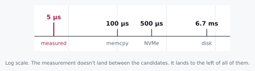

# Five Microseconds

> Any sufficiently advanced measurement is indistinguishable from a lie.

Here's a small experiment you can picture without leaving this page:
write a megabyte to a file, time the call, and see what comes back. On
an ordinary machine, on an ordinary day, it returns in about five
microseconds.

If you've run something like this a hundred times, that number probably
slides right past you. It's small, the write worked, the test passed,
on to the next thing. But five microseconds is going to turn out to be
the loudest thing that happens to you all week, and this chapter is
about learning to actually hear it.

We're not going to look anything up. By the end we'll know exactly
where that megabyte is sitting, and we'll have gotten there with four
numbers and some long division, the same tools you have at your desk
right now.

## 1.1 Two Candidates and a Missing Number

Let's start where everyone starts: where could the data actually be?

<div class="aside">
Notice that "candidates" came before "answer." We're not trying to be
right yet. We're trying to bound the space cheaply enough that being
wrong doesn't cost us anything.
</div>

Either it's still in memory, or it's out on the disk. That's a
reasonable enough first cut, and the reflex that follows is to say
*disk is slower than memory* and feel like we've made progress.

We haven't, not really. That's a **direction**, and directions can't
decide anything by themselves. Both candidates are still standing, and
we have no idea which way to lean, because we never asked the one
question that actually separates them:

**How much slower?**

This is the habit the rest of the book is built on. When we name two
possibilities, we name the ratio between them in the same breath. The
ratio is what tells us whether the question was worth asking at all.

<div class="rule" id="ratio-triage">
<span class="rule-id">Rule 1 · Ratio triage</span>
Sort your next questions by the spread between their possible answers.
A question whose answers differ by 10× splits the world. Ask it now.
A question whose answers differ by less than 2× is a detail, and
asking it early is procrastination wearing a lab coat.
</div>

## 1.2 The Axioms

Here's the part nobody quite says out loud: some of this you cannot
derive, no matter how cleverly you reason. A cache line is 64 bytes
because someone, once, chose 64. DRAM latency is whatever physics and
market economics happened to settle on. There's no first-principles
path to either number. You just have to know it, the way you have to
know a stop sign is red.

So let's take them as given. There's no shame in being handed a
constant. The only real shame is needing to be handed the conclusion
too.

| Path | Throughput |
|---|---|
| memory copy, single core | ~10 GB/s |
| NVMe SSD | ~2 GB/s |
| spinning disk | ~150 MB/s |

A dozen numbers roughly like these make up most of the toolkit. What we
do with them is the actual skill.

## 1.3 Doing the Division

One megabyte, three plausible paths home. Before reading on, it's worth
committing to a number of your own, not because the arithmetic is
hard, but because writing down a value you might be *wrong* about is
the entire point of the exercise.

```
1 MB ÷  10 GB/s  =  100 µs     memory copy
1 MB ÷   2 GB/s  =  500 µs     NVMe
1 MB ÷ 150 MB/s  =  6.7 ms     spinning disk
```

Now let's line these up against the thing we actually measured.



Sit with that for a second, because it isn't the outcome we were set up
to expect.

Five microseconds beats every option on the list, including the one
that never touches storage at all. So the conclusion isn't "it must be
in memory." The conclusion is that **our list of candidates was
wrong**.

Our ratio test didn't just rank the candidates against each other. It
caught that the question itself was malformed. That's a feature we
didn't know we were buying when we started asking about ratios.

<div class="rule" id="floor-test">
<span class="rule-id">Rule 2 · The floor test</span>
When a measurement beats your theoretical floor, the system is not
fast. The work did not happen.
</div>

Nobody moved a megabyte anywhere in five microseconds. Something got
skipped, and now we get to go find out what.

## 1.4 Turning It On Our Own Answer

The textbook reflex here is *page cache*. The kernel took the bytes,
parked them in its own memory, and returned without ever touching the
device. Deferred write-back: clever, well documented, and it feels
like an answer the moment you say it out loud.

So let's turn the floor test on it, the same way we'd turn it on anyone
else's claim.

Copying into page cache is still a memory copy. It's still a megabyte
moving through a single core at ten gigabytes a second, which is
100 µs, a number we derived a few paragraphs ago and now get to reuse.

<div class="aside">
This is the move that separates knowing the vocabulary from being able
to use it. The floor test doesn't get to sit on the shelf for other
people's claims. It applies to our own favorite answer too.
</div>

Page cache is **twenty times too slow** to explain what we saw. It
doesn't survive contact with our own arithmetic, not because we read
something that contradicted it, but because the numbers we already had
wouldn't let it stand.

So the kernel never copied our data either. Which leaves a stranger,
more interesting possibility: maybe nothing copied it at all.

## 1.5 Reading the Band

We have a floor now. We can also get a ceiling, from the other
direction.

```
plain function call, off the stack  ~1–5 ns
null syscall (post-Spectre)         ~0.5–5 µs
1 MB memcpy                         ~100 µs
```

Five microseconds is a thousand times too slow for a bare function
call, and twenty times too fast for the copy. It sits wedged between
two floors, and that particular gap has a name.

**One to ten microseconds is the signature of a syscall that did some
bookkeeping and handed the real work off.** It crossed into the kernel,
wrote something into a queue, and came straight back without moving our
bytes anywhere. That's an asynchronous submission: `io_uring`, or
something in that family.

There is a second candidate that feels just as good, and it is worth
naming precisely so we can watch it fail. Maybe no syscall happened at
all. `fwrite`, `BufWriter`, and the default file API in nearly every
language keep your bytes in your own process's memory and defer the
syscall until there's enough to make the trip worthwhile.

That is all true, and it is still not an explanation for this
measurement. Buffering does not make the megabyte disappear; it just
copies it somewhere closer. A copy into a userspace buffer is a copy,
and we already know what a megabyte of copying costs, because we
derived it two sections ago: 100 µs. To return in five, that copy
would have to run at roughly 200 GB/s through a single core, which is
an order of magnitude past what any core can do.

So the floor test takes this one too. Not because buffering isn't
real, but because it cannot move this much data this fast.

<div class="aside">
This is the third time in one chapter that the same 100 µs number has
been used to set something aside, and the second time it has taken an
answer we liked. Reusing one derived floor against every new candidate,
including our own, is most of the method.
</div>

What survives is the asynchronous submission: the syscall that queued
a pointer and returned without touching the bytes. Buffering explains
plenty of fast returns, just smaller ones. Ask for four kilobytes
instead of a megabyte and the copy costs well under a microsecond, and
buffering becomes the likeliest answer in the room. The mechanism you
land on depends on the size you asked about, which is why the megabyte
was in the question at all.

## 1.6 Resisting `strace`

Here's where most of us reach for a tool. It's worth resisting for one
more second and asking what the tool would actually buy.

We're separating "no syscall" (nanoseconds) from "syscall that
enqueued" (microseconds), three orders of magnitude apart. No amount
of measurement noise, scheduler jitter, or thermal drift closes a
1000× gap. **The stopwatch already answered it.**

<div class="rule" id="instrument-precision">
<span class="rule-id">Rule 3 · Match the instrument to the ratio</span>
1000× apart, use a wall clock. 20× apart, use a wall clock carefully.
1.5× apart, now you need counters and statistics. Reaching for a
profiler on a 1000× gap isn't rigor. It's procrastination that
produces artifacts.
</div>

For the day you genuinely need them: `strace -c` counts syscalls,
`perf trace` times them. They're excellent, and you should need them
far less often than you'd think.

## 1.7 So Where Is It

Four layers, in the order they'd survive:

```
   YOUR PROCESS
 ┌──────────────────┐
 │ userspace buffer │  gone if your process crashes
 └──────────────────┘
          │  write()        ~1–5 µs
          ▼
   THE KERNEL
 ┌──────────────────┐
 │   page cache     │  survives a crash
 └──────────────────┘  DIES on power loss
          │  fsync()        ~100 µs – 10 ms
          ▼
   THE DEVICE
 ┌──────────────────┐
 │   drive cache    │  still volatile
 └──────────────────┘
          │
          ▼
 ┌──────────────────┐
 │  FLASH / PLATTER │  actually durable
 └──────────────────┘
```

At five microseconds, we're at level one. Not two, not four.

Worth noting: `write()` actually is the syscall that *leaves*
userspace. The name is a little misleading. Data lands in page cache.
And `fsync()` isn't "send it to the kernel"; it's already there.
`fsync` is what pushes it *out* of the kernel toward the media.

Most people already know about `fsync`. What catches people off guard
is subtler: the default path in nearly every file API stops one level
short of durable, and you have to opt into that last step on purpose.
Closing a file flushes userspace into the kernel. It does not sync.

Which sets up everything in Part II. That last arrow turns out to be
expensive enough that entire database architectures exist just to avoid
taking it more than they have to.

<div class="aside">
<strong>Run it.</strong> <code>experiments/01_write_latency.c</code> writes
a megabyte four ways and prints each one against the floors above. Commit
to your four numbers before you run it. See <a href="./experiments.md">Experiments</a>.
</div>

<div class="challenges">

## Challenges

No answers here on purpose: re-deriving is the point. If you wanted to
re-read, you'd have the chat log.

1. You measure a 4 KB write at 900 ns. Which layer is it at, and what
   floor did you use to decide?

2. Your service acks a client immediately after `write()` returns.
   Name the exact failure that loses acknowledged data, and the one
   that doesn't.

3. A colleague says an optimization made the write path "three times
   faster." Using Rule 3, what's the first thing you'd ask, and what
   would make you reach for `perf` instead of a stopwatch?

4. `fsync` on NVMe costs ~100 µs. `write()` costs ~5 µs. Derive the
   maximum sustainable durable-write rate for a system that syncs once
   per request, and explain why real databases beat that number anyway.

</div>

<div class="challenges" id="design-note">

## Design Note: Procrastinating With Rigor

There's a specific failure mode that looks exactly like diligence.

You have a question. Instead of estimating an answer, you instrument.
Flame graphs, tracing, a benchmark harness, an argument about
statistical significance. Three days later you have beautiful data
about something a single division would have settled in ten seconds.

The tell is that you never wrote down what you *expected*.
Instrumentation without a prediction has no failure condition: every
result looks interesting, nothing is surprising, and you learn
surprisingly little, because nothing you believed was ever actually put
at risk.

The discipline is cheap, and it stings a little: before you measure,
commit to a number. Not "faster." Not "I expect an improvement." A
number, with units, that you'd be a little embarrassed to be wrong
about by 10×.

Being wrong that way is the thing that makes a lesson stick.

</div>
