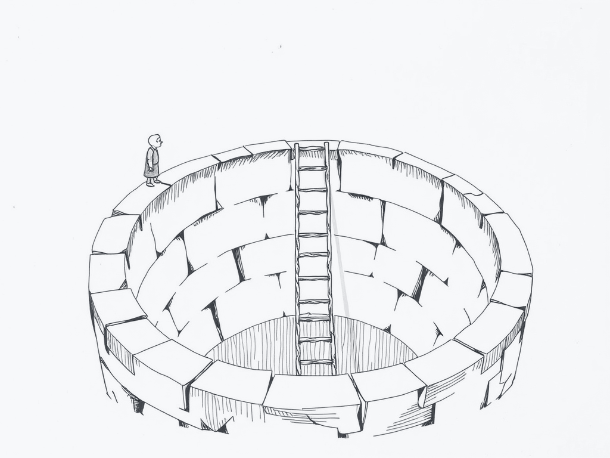
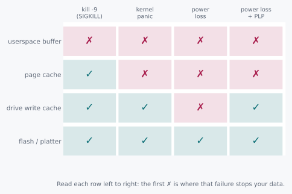

# The Ladder

> Your test suite has never once lost power.



Let me tell you about a test that passed ten thousand times and proved
nothing at all.

We build a crash-test harness for a write path we care about. It sends
`kill -9` to the process mid-write, at a random byte offset, ten
thousand times. Zero bytes lost. Every single run. That feels
wonderful, so we ship it.

Six weeks later somebody runs the same workload through a power-fault
rig instead. Not a signal: an actual switch that cuts the wall socket.
It loses data on the very first try.

Ten thousand for ten thousand on one test. Zero for one on the other.

<p class="quip">Ten thousand passes and a single failure, and the single failure is the only one that was asking the right question.</p>

Now, that is not a flaky test. I want to be firm about this, because
"flaky" is the word everyone reaches for and it is the wrong word, and
reaching for it is how the afternoon gets wasted. Those are two
different questions wearing the same costume, and the costume is the
word "crash."

## 2.1 Two Candidates and a Missing Number

The natural reflex is to treat this as a probability problem. `kill -9`
failure is rare, power-loss failure is common, go collect more samples
and find the true rate.

Resist that. Ask Rule 1's question first: how much do the candidate
answers actually differ?

And here the honest answer is that this is not a spread at all. It is a
category error. `kill -9` removes a *process*. A power cut removes
*power to the machine*. Those are not two points on one axis. They are
different axes, and no quantity of extra sampling on one turns into
evidence about the other.

<div class="aside">
A sharper version of ratio triage: sometimes the "spread" between two
candidates is not a number, and computing one anyway is exactly how we
talk ourselves into a false sense of coverage. The arithmetic was
available. It was just arithmetic about the wrong thing.
</div>

So the real question underneath "why did these two tests disagree" is a
different one entirely: **what does each failure actually destroy?**
Answer that, and both results stop being surprising at all.

## 2.2 The Axioms

There are four places a byte can live between `write()` and safe
forever. Each one is owned by something different, and ownership is the
thing that determines what can kill it.

| Layer | Owned by | Process death | Kernel panic | Power loss |
|---|---|---|---|---|
| Userspace buffer | Your process | No | No | No |
| Page cache | The kernel | Yes | No | No |
| Drive write cache | The device | Yes | Yes | **Only with PLP\*** |
| Flash / platter | The device, non-volatile | Yes | Yes | Yes |

*PLP = power-loss protection, explained below.

That third row is the one nobody's intuition gets for free, and it is
worth a digression, because it is where the money is.

<p class="quip">The capacitor costs about forty cents. It is the difference between a drive that keeps its promises and one that merely makes them.</p>

Consumer SSDs and spinning disks both carry a small volatile write
cache *on the device itself*. Not in your process. Not in the kernel.
Physically on the drive, after the data has already left the operating
system entirely. The drive accepts your bytes into that cache and tells
the kernel it is done, because from the drive's point of view it is
done, and the drive has no opinion about your durability requirements.

Enterprise drives often ship power-loss protection: a capacitor, sized
to hold enough charge to finish flushing that cache during the few
milliseconds after somebody pulls the plug. Consumer drives usually do
not. Same interface, same "write complete," same everything you can see
from software.

So two drives can both report success and quietly disagree about
whether that success survives a power cut, and the only difference
between them is a component you cannot query, on a part of the machine
your code never touches. I find that a little frightening, and I think
you should too.

## 2.3 Doing the Division

There is arithmetic here, and it is not the arithmetic the harness
looked like it was doing.

Ten thousand clean runs is a real statistical result. When you see zero
failures in n trials, the ninety-five percent upper bound on the true
failure rate is about 3/n. So the harness bought us a genuinely precise
number:

```
     10,000 runs, 0 failures  ->  failure rate below 1 in 3,339
  1,000,000 runs, 0 failures  ->  failure rate below 1 in 333,809
```

That is defensible and it was not free. Somebody's machine ran for
hours. Which makes it worth being exact about what it is a number
*about*.

`kill -9` deletes a process. A process owns row one. So every one of
those ten thousand trials was a trial of row one, and not one of them
was a trial of anything else. Run the division again with that column
added:

```
  trials that reached row 1        10,000
  trials that reached row 3             0

  95% bound, row 1 data loss   1 in 3,339
  95% bound, row 3 data loss          100%
```

Zero trials support no bound at all.

After ten thousand runs, our honest upper bound on losing acknowledged
data to a power cut is one hundred percent. Exactly where it stood
before anybody wrote the harness. Ten million runs would leave it at
one hundred percent too, and so would ten billion, and this is the part
I want you to feel: the number does not improve, ever, no matter how
long you run it, because the experiment cannot reach the thing.

<p class="quip">Statistics will cheerfully hand you a confidence interval on a question you never asked, and it will be a beautifully tight one.</p>

The test was not flaky and it was not lucky. It was accurate to three
significant figures about row one, while the data we were worried about
lived three rows further down.

<div class="rule" id="failure-fidelity">
<span class="rule-id">Rule 4 · Test the failure you claim to survive</span>
A crash test that cannot reach the layer your data lives in has proven
nothing about that layer. Count rows before you count nines.
</div>

## 2.4 What This Rules Out

This retires a comfortable piece of folk wisdom: "we crash-test in CI,
we're covered."

Covered against what, though? If the harness only ever sends `SIGKILL`,
it has validated exactly one row of the ladder, and it is the row that
was never in danger, because page cache does not care in the slightest
whether your process is still alive. The kernel is holding your bytes.
The kernel is fine. It watched your process die with total equanimity.

<p class="quip">"We crash-test in CI" is a sentence about the CI. It is not a sentence about the crash.</p>

The claim that needed testing was different: *does an acknowledged
write survive losing the wall socket?* Answering that requires reaching
row three or four. Which needs `fsync()`, which is the next chapter,
and a fault injector that removes power rather than signals: an IPMI
power-cycle, a managed PDU, a physical switch, somebody's foot.

Nothing short of that reaches the rows where the real risk lives.

## 2.5 The Pictorial

The table in 2.2 has the same information, but a table hides the thing
that matters. Arrange it as a grid and the boundary jumps out: for each
kind of failure there is one row where the crosses start, and that row
is where your data stops being yours.



<div class="aside">
Read each column top to bottom. The first ✗ you hit is where that
failure mode stops your data. `kill -9`'s ✗ sits at the very top. Power
loss without a capacitor puts its ✗ two rows deeper than most test
suites ever bother to look.
</div>

<p class="quip">Chapter 1 got you to row one in twenty-five microseconds. The other three rows take the rest of the book.</p>

Twenty-five microseconds put you on row one, back in chapter 1. The rest of
this book is about what it costs, in time and in engineering, to walk
down to row four on purpose. And about not fooling yourself into
thinking you are already standing there.

<div class="challenges">

## Challenges

1. Your crash harness now uses `kill -9` *and* reboots the VM (a clean
   `reboot`, not a power cut) between runs. Which row does that
   combination actually validate, and which row does it still miss?

2. A colleague proposes testing power loss by calling `echo b >
   /proc/sysrq-trigger` (immediate reboot, no shutdown sequence) instead
   of physically cutting power. Where does that sit on the ladder:
   closer to `kill -9` or closer to a real power cut? Justify it from
   what each one actually destroys.

3. An NVMe drive's spec sheet doesn't mention power-loss protection.
   What experiment would tell you whether it has it, without opening
   the case?

4. You have a fleet of machines behind a shared UPS. The UPS itself has
   a failure rate. Redraw the ladder's power-loss column as a function
   of UPS reliability. At what UPS failure rate does "no PLP on the
   drive" stop being a real risk in practice?

</div>

<div class="challenges" id="design-note">

## Design Note: Coverage Is a Claim About a Layer, Not a Count

"We have a crash test" and "we have crash *coverage*" are not the same
sentence, and the gap between them is exactly the ladder.

A test count is seductive because it is a single number and it goes up.
Ten thousand runs feels like more assurance than one hundred, and in a
status meeting it reads like more assurance too. But the count only
starts to matter *after* you have established that the test can reach
the failure you are worried about. A million `kill -9` runs against a
page-cache claim is a million data points about a question nobody
asked.

So before adding a zero to your run count, ask which row the test can
possibly fail at. If the honest answer is row one, then more runs buy
you a tighter confidence interval on a claim that was never keeping you
up at night.

Better to redirect that effort at reaching row three, even if the run
count goes down by three orders of magnitude as a result. Ten power
cuts that reach the drive cache tell you something. Ten million signals
that cannot reach it tell you the same thing they told you at run one,
which is nothing.

</div>
