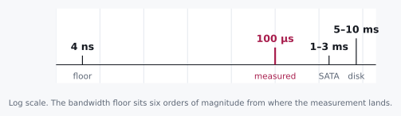

# The Barrier

> fsync is not a save button. It is a purchase.

Here is a loop you can write in about a minute. Take an 8-byte counter.
Append it to a file. Do that over and over.

In memory, that loop runs fifty million times a second. Now add one
call, `fsync()` after every append, and it runs two thousand times a
second.

Twenty-five thousand times slower. To persist eight bytes.

Not eight megabytes. Eight bytes. Hold that number next to the size for
a moment, because whatever `fsync` is charging us for, it plainly is
not the data.

## 3.1 Two Candidates and a Missing Number

Candidate one: `fsync` is slow because it moves our bytes to the
device, and moving bytes takes time proportional to how many there are.

Candidate two: `fsync` is slow for some reason that has nothing
whatsoever to do with how many bytes we handed it.

Name the ratio before you pick. At even a modest 2 GB/s of device
bandwidth, eight bytes should cost:

```
8 B ÷ 2 GB/s ≈ 4 nanoseconds
```

We measured about 100 microseconds for that same call.

That is not a near miss. That is **25,000×** over the bandwidth floor.
Candidate one is not slightly wrong, or wrong in the details. It is
wrong by more than four orders of magnitude, which is the kind of wrong
you can see from orbit. Set it aside.

<div class="aside">
This is chapter 1's floor test run in the opposite direction. There, a
measurement came in <em>under</em> every floor and proved work had been
skipped. Here it comes in wildly <em>over</em> the bandwidth floor and
proves the cost is not the thing we assumed we were buying. Same
instrument. You are just reading it from the other end.
</div>

## 3.2 The Axioms

| Device | Typical `fsync` latency |
|---|---|
| NVMe SSD | ~100 µs |
| SATA SSD | ~1–3 ms |
| 7200 RPM spinning disk | ~5–10 ms |

Roughly a hundredfold spread top to bottom. But that is not the
interesting part of the table, and if you take only one thing from it,
take this instead: every one of those numbers stays nearly flat whether
you sync 8 bytes or 8 kilobytes.

That flatness is the whole tell.

If a cost barely moves when you change the payload by a factor of a
thousand, then the payload was never the dominant term. It was not even
close to being the dominant term. You are paying for something else
entirely, and the size of your data is a rounding error on the bill.

## 3.3 Doing the Division

So what is `fsync` actually? It is a **barrier**.

It blocks until every write queued before it is provably sitting on
non-volatile media. And it makes a second promise, one the name hides
completely: a promise about *order*. Nothing after the barrier gets to
be considered durable before everything ahead of it is.



Once you see it as a barrier rather than a save button, the cost stops
being mysterious. Paying it once for a batch of a thousand records, and
paying it a thousand times for those same thousand records one at a
time, are not remotely the same purchase. The first is one round trip.
The second is a thousand of them, each one carrying almost nothing.

<div class="rule" id="boundary-not-spray">
<span class="rule-id">Rule 5 · Buy durability at boundaries, not by the record</span>
`fsync` cost is dominated by the round trip to the barrier, not the
bytes behind it. Pay it once per boundary you actually need to defend,
never once per write.
</div>

## 3.4 What This Rules Out

This rules out the intuition that durability is something you sprinkle
on. "Just fsync after every write, to be safe."

Safety is not the axis that scales badly here. Call *count* is. A
service that fsyncs every record has chosen to pay a toll of 100 µs to
10 ms on every operation, however small, because the toll booth does
not care what is in the trunk. It charges for the stop.

Now let me push on something we have been treating as one thing, because
I think it is really two, and separating them is what the next chapter
is built on.

Durability and ordering are different purchases. You can imagine a
system that needs its writes applied in order but does not need each
one durable the instant it lands. You can imagine the reverse too:
durability, with no opinion at all about relative order. Those are
genuinely different requirements, and a careful engineer might want to
buy them separately.

`fsync` will not let you. It sells both, bundled, whether or not you
wanted the bundle.

And once you notice that, the design that follows is almost forced. Put
only the thing that must be *ordered and durable* behind the barrier,
and let everything else move lazily along behind it. That is chapter 4,
and that is the entire idea.

## 3.5 The Pictorial

```
 record 1 ─┐
 record 2 ─┤  queued, unordered w.r.t. the barrier
 record 3 ─┘
           │
     ══════╪══════  fsync()  ←  the barrier: one round trip,
           │                    ~100 µs – 10 ms, size-insensitive
           ▼
 [ record 1 | record 2 | record 3 ]  ← provably durable, in this order,
                                        only past this line
```

<div class="aside">
Fsync-per-record redraws that picture a thousand times for a thousand
records. A thousand barriers, each paying a full round trip to escort a
single row across. Group commit, in chapter 5, is what happens once you
let the queue fill up before you draw the line.
</div>

<div class="aside">
<strong>Run it.</strong> <code>experiments/03_fsync_cost.c</code> syncs
payloads from 8 B to 8 MB and prints how far the cost moved against how far
the size moved. Predict that ratio first. See <a href="./experiments.md">Experiments</a>.
</div>

<div class="challenges">

## Challenges

1. You batch 100 records behind one `fsync` instead of syncing each
   individually. Using the NVMe number above, what's the best-case
   throughput improvement, and what would make the real improvement
   fall short of it?

2. A teammate suggests using `fdatasync` instead of `fsync` to skip
   metadata (mtime, size) updates. Under what circumstance does that
   optimization not actually save a barrier crossing?

3. Two threads each call `fsync` on the same file at nearly the same
   time. Does the second call's cost look like a second full barrier,
   or something cheaper, and what would you measure to find out, per
   Rule 3?

4. `O_DIRECT` writes bypass the page cache entirely. Does that make
   `fsync` unnecessary for durability? Name the specific claim `fsync`
   makes that a direct write, by itself, does not.

</div>

<div class="challenges" id="design-note">

## Design Note: The Bundle You Didn't Ask For

Every `fsync` call sells two things at once. *This data is durable*,
and *everything before it happened first*. Most of us only ever reach
for it because we want the first one, and we pay for the second without
ever noticing there was a second.

That would be fine if the second one were free. It is not. Ordering
guarantees are precisely what turn a bandwidth-bound operation into a
latency-bound one, because proving order means waiting for
confirmation, and waiting is the exact opposite of throughput. You
cannot pipeline a promise.

The systems that get this right unbundle it deliberately. They find the
one thing that genuinely needs the full barrier, and it is almost
always a small append-only log, and then they let everything downstream
inherit durability without ever calling `fsync` on its own behalf.

There is no trick in that. Nothing clever. They just declined to buy
the bundle twice, which turns out to be a good deal of what separates a
database from a program that writes files.

</div>
