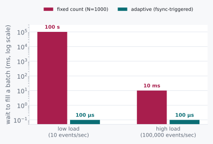

# Group Commit

> A constant that works at one load level is a bug waiting for load to change.


Say we have read chapter 3 and taken it seriously. Fsync-per-record was
costing 25,000× what the bytes warranted, so we batch. Collect a
thousand records, fsync once, acknowledge all of them together.

Under load, throughput jumps fifty-fold. We ship it. We are pleased
with ourselves, and I think reasonably so.

<p class="quip">A hundred seconds. Long enough to make a cup of tea while your database decides whether your write happened.</p>

Then overnight, traffic drops to ten events a second. And the same
code, unchanged, takes **one hundred seconds** to acknowledge a single
write.

Now, nothing broke. I want to be careful about that, because the
instinct is to go hunting for the bug. There is no bug. The arithmetic
is exactly the arithmetic we should have expected: a thousand records
arriving at ten per second takes a hundred seconds to fill the batch.
We did not introduce a defect. We hard-coded a load level, and then the
load politely changed on us.

## 5.1 Two Candidates and a Missing Number

So the constant was wrong. The interesting question is whether we should
pick a better one or stop picking one, and those are genuinely different
positions rather than degrees of the same one.

The first: pick a bigger fixed batch for throughput, a smaller one
for latency, and tune the constant to match our traffic.

The second: stop picking a constant at all.

Name the ratio, because the ratio is the whole argument. A fixed batch
of 1000 costs us:

```
at 100,000 events/sec:  1000 ÷ 100,000  =  10 ms  to fill    (fine)
at      10 events/sec:  1000 ÷      10  = 100  s  to fill    (not fine)
```

**Ten million times worse.** Same constant. Just a quieter night.

<p class="quip">The constant did not change. The world did, and the constant had no way of finding out.</p>

And that number is the argument against the first all by itself.
There is no single value of N that is safe across a range that wide.
Whatever you pick is correct at the traffic level you tuned it for and
wrong by orders of magnitude everywhere else, and the place it is most
wrong is the place nobody is watching, which is three in the morning.

<div class="aside">
A fixed time window ("always wait 10 ms") looks like the fix, and it
does bound the worst case. But it also <em>forces</em> every request to
pay that 10 ms even at 3 a.m. when nobody is behind you and the fsync
could have gone out immediately. That trades a variable disaster for a
constant tax, which is an improvement, but a disappointing one.
</div>

## 5.2 The Axioms

One fact, and chapter 3 already handed it to us: an `fsync` round trip
costs about the same whether it carries one record or a thousand.

| Path | Cost per fsync |
|---|---|
| NVMe, one record | ~100 µs |
| NVMe, a thousand records | ~100 µs |

Look at that table for a second longer than it seems to deserve,
because that equality is the entire opportunity.

<p class="quip">Only one of these questions requires guessing about the future, which is a good reason to prefer the other one.</p>

If a barrier crossing is nearly free per additional record, then the
thing worth optimizing is not how many records we force ourselves to
wait for. It is how many records happen to arrive during a crossing we
are *already paying for*. Those are completely different questions, and
only one of them requires us to guess about the future.

## 5.3 Doing the Division

So let's not set N at all. Let's set a rule instead.

**When the in-flight `fsync` returns, immediately start the next one,
and sweep in everybody who arrived while the first was in flight.**

```
t=0         fsync #1 issued (covers whatever's queued right now)
t=0..100µs  requests 2, 3, 4 arrive; they queue behind fsync #1
t=100µs     fsync #1 returns → ack 1; fsync #2 issued, covers {2,3,4}
t=100..??   whatever arrives now queues behind fsync #2
t=200µs     fsync #2 returns → ack 2,3,4; fsync #3 issued, covers {...}
```

Now watch what the batch size does. Nobody set it. It falls out of the
arrival rate on its own.

At high load, dozens of requests pile up during one 100 µs window and
ride across together, so we get the throughput win without ever naming
a number. At low load, a request often finds nobody else queued at all,
its "batch" is size one, and it waits exactly one fsync round trip.
Not a hundred seconds. One round trip, which is the least it could
possibly have waited.

<p class="quip">The best batch size is the one nobody chose. There is a lesson in there about several other constants in your codebase.</p>

That is the pleasing part. The scheme is not a compromise between the
two cases. It is optimal at both ends, and it got there by refusing to
answer a question it did not have to answer.

<div class="rule" id="adaptive-batching">
<span class="rule-id">Rule 7 · Let the barrier set its own batch size</span>
Close the batch when the in-flight fsync returns, not when a counter
hits a constant. The batch size becomes a function of load instead of a
guess about it.
</div>

## 5.4 What This Rules Out

This rules out fixed-count and fixed-window batching as general
answers. Not because either is wrong exactly, but because each one
encodes an assumption about load that the adaptive version simply does
not need to make. Fixed-count breaks at the low end. Fixed-window taxes
everyone, always, including when nobody is waiting.

There is one wrinkle the naive adaptive version misses, and it is worth
chasing down because it is the sort of thing that only shows up in
production.

At *moderate* load, just under one arrival per fsync-latency window,
batches regress toward size one anyway, and we find ourselves firing an
`fsync` for very nearly every record. That is not a correctness
problem. Latency is fine. Throughput is fine. But it is the maximum
possible call rate, and on flash media, call rate correlates with write
amplification, and write amplification is measured in years off the
drive's life.

The fix is a small floor: hold the batch open for a minimum of roughly
200 µs, even if the in-flight fsync would have returned sooner. That
caps how often the device gets hit, at the cost of a bounded, small,
constant addition to latency.

<p class="quip">The rejected idea comes back in the last act, behaving itself. This happens more often than the tidy version of engineering admits.</p>

Which is the same trade as the fixed window we rejected two sections
ago. Exactly the same trade. The difference is that here it is sized to
be negligible instead of dominant, and I think that is worth saying out
loud: the idea was never bad, it was just badly sized.

## 5.5 The Pictorial

The clearest way to see the difference is to put both policies on the
same axis at two very different loads, and notice which one changes
shape when the traffic does:



<div class="aside">
This is the same amortization trick as batching writes before `fsync`
in the first place, and (a small spoiler for chapter 7) the same trick
that makes GPU batching worthwhile. Pay a fixed round-trip cost once,
then spread it across whoever showed up while you were paying it. You
will see this shape three more times before the book is done.
</div>

<div class="aside">
<strong>Run it.</strong> <code>experiments/05_group_commit.c</code> runs both
policies against real fsyncs at two arrival rates. Watch the adaptive batch
size change between them without anyone setting a number. See
<a href="./experiments.md">Experiments</a>.
</div>

<div class="challenges">

## Challenges

1. At exactly one arrival per fsync-latency window, adaptive batching's
   average batch size converges to what? Is that better or worse than
   fixed-count N=2 at the same load?

2. Your floor is 200 µs. Load spikes to 50,000 events/sec, well above
   what one fsync can drain in 200 µs. What happens to the queue, and
   does the floor still help or start hurting?

3. Two independent adaptive-batching writers share the same underlying
   log file. What has to be true about how they coordinate fsync calls
   for the scheme in 5.3 to still be correct?

4. Redraw the 5.1 arithmetic for a system with two tiers of durability
   need: some callers require the fsync ack, others are fine acking
   off the page cache. Does one adaptive batch still serve both, or do
   you need two?

</div>

<div class="challenges" id="design-note">

## Design Note: Tuning a Constant Is Postponing a Bug

Every hardcoded batch size, timeout, and thread-pool count is a bet
that tomorrow's load looks like today's.

The bet is usually fine. That is what makes it dangerous. It holds
through the tuning, through the load test, through the first six months
in production, and then traffic has a bad night or a good launch or a
regional failover doubles one region's share, and the constant does not
fail loudly. That is the part I want to underline. It does not page
anybody. It just quietly stops being the right answer, and the system
keeps running, worse, until somebody eventually notices a hundred-second
tail on a dashboard nobody was looking at.

The fix is not a better constant. It never is.

The fix is noticing which inputs to your formula are actually
*observable at runtime*. Here it was one bit of information: is the
fsync still in flight? That bit was sitting there the whole time, free,
and it is strictly better than any number a human could have picked,
because it is measured rather than assumed.

If you can replace a constant with a measurement the system already has
in hand, that is not a nice-to-have. That is removing a bug before it
happens, and those are the cheapest bugs you will ever fix.

</div>
