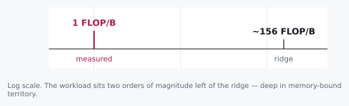
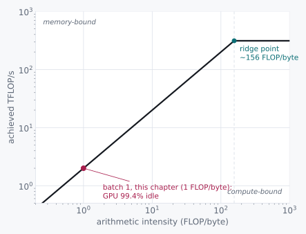

# The Ridge

> Arithmetic intensity, and the 99% idle GPU.


I want to show you a machine that costs thirty thousand dollars and
spends nearly all of its life doing nothing at all.

It is an A100, and it can perform three hundred and twelve trillion
arithmetic operations every second. We hand it a 7-billion-parameter
model and ask for a single word. It computes for forty-five
microseconds. Then it waits for seven milliseconds.

<p class="quip">Thirty thousand dollars of silicon, idle 99.4% of the time. Even a landlord would be embarrassed.</p>

Do the fraction. The thing is busy six-tenths of one percent of the
time.

Now, when you first see a number like that, the natural thing to think
is that somebody made a mistake. Sloppy code, a bad driver, an engineer
who did not know what they were doing. I thought exactly that, the
first time I saw it. It is the comfortable explanation, because it
means somebody can go and fix it.

It is not a mistake. And what I want to show you is how you can prove
that with arithmetic you can do on a napkin, and how, once you see why
the machine is idle, you also see precisely what to do about it.

## 7.1 Two Candidates and a Missing Number

There are only two possibilities worth taking seriously here.

Either producing a word takes an enormous amount of arithmetic and the
chip is straining to keep up. Or it takes hardly any arithmetic at all,
and the chip is sitting there waiting on something that has nothing to
do with arithmetic.

Those call for opposite remedies, so before anybody argues about which
it is, let's just count. Generating one token from a 7B model, batch
size one, costs roughly:

```
compute:  2 × 7×10⁹ params  ≈  14 GFLOP
memory:   7×10⁹ params × 2 bytes (fp16)  =  14 GB  read
```

Fourteen billion operations. Fourteen billion bytes.

**One operation per byte moved.**

That ratio has a name, arithmetic intensity, and it is the only number
this chapter needs in order to compute everything else.

## 7.2 The Axioms

One FLOP per byte is a fact about our workload. To know whether that is
a lot or a little, we need the matching fact about the hardware, and
that one we have to be handed. Two numbers off a spec sheet, and one
ratio between them:

| Quantity | A100 (SXM, fp16) |
|---|---|
| Peak compute | ~312 TFLOP/s |
| Peak memory bandwidth | ~2 TB/s |
| **Ridge point** (compute ÷ bandwidth) | **~156 FLOP/byte** |

The ridge point is where a workload stops being memory-bound and starts
being compute-bound, on this specific piece of silicon.

Below it, the chip finishes its math faster than it can be fed, and
sits idle waiting on the memory bus. Above it, the bus delivers data
faster than the chip can chew through it, and the arithmetic units
become the limit. It is a property of the hardware and nothing else. It
does not know what you are running.

## 7.3 Doing the Division

Our workload sits at 1 FLOP/byte. The hardware's ridge is around 156.
Let's line them up.



Now convert both halves into time, using the axioms:

```
compute time:  14 GFLOP ÷ 312 TFLOP/s  ≈  45 µs
memory time:   14 GB ÷ 2 TB/s          ≈  7 ms
```

Memory time is about **156× longer** than compute time.

That is not a coincidence, and it is worth pausing on. That ratio *is*
the ridge point, restated in seconds instead of FLOP per byte. The same
number, wearing different units, arrived at from a completely different
direction. When that happens you are usually onto something real.

The chip finishes its 14 GFLOP in 45 microseconds and then waits 6.95
milliseconds for the next byte of weight to show up.

<div class="rule" id="ridge-before-flops">
<span class="rule-id">Rule 9 · Check arithmetic intensity before adding FLOPs</span>
Below the ridge point, more compute buys nothing. The wait is on
bytes, not operations. A faster chip with the same memory bandwidth
generates the same token in the same amount of time.
</div>

## 7.4 What This Rules Out

This rules out the instinct to fix slow generation by buying a
higher-TFLOPS card.

If your bottleneck sits 156× to the left of the ridge, tripling peak
compute moves the ridge point further *right* and helps you not at all.
You were never anywhere near the compute wall. You would be buying more
of the thing you already have too much of, which is a wonderfully
expensive way to change nothing.

What would move the needle is more memory *bandwidth*. Or, and this is
cheaper and much more interesting, changing the workload's arithmetic
intensity itself.

Which is what this chapter has been building toward. At batch size one,
we read the entire 14 GB of weights **to compute one token's worth of
math**. At batch size 32, we read the same 14 GB once and compute
thirty-two tokens' worth of math against it before the next byte has to
arrive. The memory cost did not grow with batch size. The compute did.

It is worth doing that division in symbols, because the answer comes
out cleaner than it has any right to. Call the parameter count N. Each
weight is two bytes in fp16, and each weight takes part in exactly one
multiply-and-add, which is two operations. At batch size B:

```
bytes moved  =  2 bytes/weight × N              =  2N
operations   =  2 ops/weight × N × B sequences  =  2NB

                 2NB
intensity  =  --------  =  B FLOP/byte
                  2N
```

The twos cancel. The parameter count cancels. What is left is the batch
size itself.

Arithmetic intensity, for this workload, *is* B. Not approximately. Not
in the limit. At batch 32 we sit at exactly 32 FLOP/byte, still under
the ridge but far closer to it, and throughput scales almost for free
on the way there.

That identity is the thing to carry out of this chapter. It turns the
ridge point from a property of the silicon into a number you can type
into a config file. A ridge of 156 FLOP/byte says, in plain language,
run about 156 sequences at once. Every serving system in the world
exposes that number as a tunable, and now you know what it is tuning
against.

<div class="aside">
The clean cancellation is an accident of fp16, where two bytes per
weight happens to match two operations per weight. Store the weights in
fp8 and the bytes halve while the operations do not, so intensity
becomes 2B. Quantization buys arithmetic intensity <em>and</em> a
shorter read, which is two independent wins from one change. Challenge
3 is worth redoing with that in mind.
</div>

<div class="aside">
This is <a href="./05-group-commit.md#adaptive-batching">group
commit</a>, again, and I hope by now it looks familiar. There, a fixed
fsync round trip got amortized across however many writers had queued up
behind it. Here, a fixed weight-read gets amortized across however many
tokens' worth of compute we can pile up before the next byte has to
move. Same trick. Different barrier. It will happen twice more.
</div>

## 7.5 The Pictorial

All of this fits on one chart, and it is worth learning to read because
you will meet it again for the rest of your career. Arithmetic intensity
runs along the bottom. The diagonal is what memory can feed you; the
flat top is what the chip can compute. Where they meet is the ridge, and
everything to the left of it is waiting:



<div class="aside">
Batching walks us rightward along the rising slope, not up onto the
plateau. Still memory-bound, just less wastefully so, until we are
batched heavily enough to reach the ridge itself.
</div>

<div class="aside">
<strong>Run it.</strong> <code>experiments-gpu/07_roofline.py</code> measures
your own card's ridge point rather than quoting the A100's, then walks a batch
size toward it. A free Colab T4 is enough. Predict your ridge, and the percent
of peak you will get at batch 1, before you look. See
<a href="./experiments.md">Experiments</a>.
</div>

<div class="challenges">

## Challenges

1. Batch size 32 gets you to ~32 FLOP/byte, still left of the ridge.
   What batch size would this workload need to actually reach ~156
   FLOP/byte, and what has to be true about your traffic for that
   batch to fill up without unacceptable latency?

2. A 13B model has roughly double the weight bytes and double the
   FLOPs per token of the 7B one. Does its ridge crossing point (in
   batch size) change, stay the same, or move, and in which
   direction?

3. Quantizing weights from fp16 to int8 halves the bytes read per token
   without changing the FLOP count much. Recompute arithmetic intensity
   at batch 1 under int8, and say whether this workload is any closer
   to the ridge.

4. Prefill (processing a whole prompt at once) replaces the
   matrix-*vector* multiply this chapter used with a matrix-*matrix*
   multiply, because many tokens' worth of activations move through the
   weights together instead of one at a time. Redo the 7.1 arithmetic
   for a 2048-token prefill pass: does the FLOP count grow with prompt
   length, does the byte count, and where does arithmetic intensity
   land relative to the ridge? (Nothing above answers this; you'll
   need to derive the matrix-matmul FLOP count yourself.)

</div>

<div class="challenges" id="design-note">

## Design Note: The Ridge Doesn't Care How You Feel About the GPU

"99.4% idle" reads like a scandal the first time you compute it, and
the natural response is to go looking for somebody to blame. Bad
kernels. An unoptimized runtime. A driver issue. Somebody upstream who
did not care enough.

Usually none of that is true. The chip is idle because the arithmetic
says it should be idle, and no amount of engineering effort inside a
single forward pass, at batch size one, changes which side of the ridge
you are standing on. You can rewrite that kernel with enormous skill
and win nothing, and the failure will feel like your fault, and it will
not be.

The lesson generalizes past GPUs. Any time you are tempted to profile
harder to explain a bottleneck, check arithmetic intensity against the
hardware's ridge point first. If you are two orders of magnitude to the
left of it, the profiler is going to show you a chip waiting on memory
no matter how you slice the flame graph, and the fix was never going to
live inside the kernel you were about to spend a week on.

</div>
