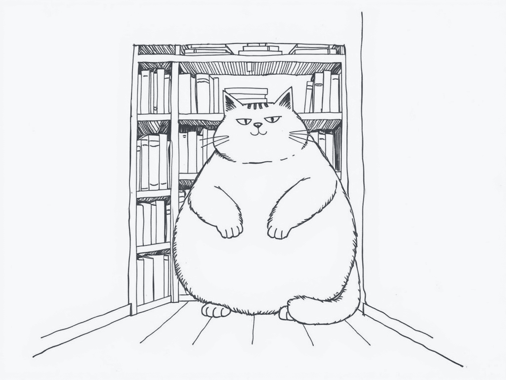
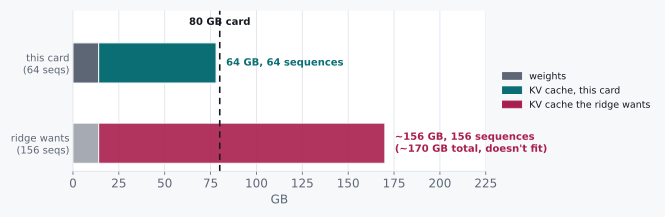

# The Cache That Ate the Batch

> 512 KB per token, and why the field went where it went.



Chapter 7 ended with an instruction that felt like a victory. Batch 156
sequences together and we reach the A100's ridge point: the GPU stops
idling, compute finally becomes the limit, everybody goes home happy.

So let's try it. Same 7B model, 80 GB card.

We run out of memory at roughly **64**.

Not 156. Sixty-four. Less than half, and it is not close. We did not
tune a knob and miss by ten percent. The process died with an
out-of-memory error, two and a half times short of the target the
previous chapter set for us.

Something is spending memory that chapter 7 assumed was free.

## 8.1 Two Candidates and a Missing Number

Something is eating the difference, and there are two obvious suspects.
One of them is a scheduling problem we could fix by being cleverer. The
other is a cost we simply never counted.

The first: this is a scheduling problem. We are padding
variable-length sequences to a common size, and the padding is eating
the capacity.

The second: it is not padding at all. There is a second, growing
memory cost that chapter 7 never priced.

Before we go hunting for padding bugs, it is worth checking the ratio.
And the fastest way in is to ask what chapter 7 actually accounted for.

It accounted for exactly one thing living on that GPU: 14 GB of
weights. It said nothing whatsoever about what accumulates *during*
generation.

Now think about what has to accumulate. Every token already produced
leaves behind a cached Key and Value tensor, kept around so the next
token does not have to recompute attention over the entire prefix from
scratch. That cache has a size. And it was completely absent from last
chapter's arithmetic, not because anybody was careless, but because at
batch size one, generating one token, there was nothing yet to
accumulate.

## 8.2 The Axioms

For a 7B-class model (32 layers, 4096-dim hidden state, fp16):

| Quantity | Value |
|---|---|
| KV cache per token | 2 × 32 layers × 4096 dim × 2 bytes = **512 KB** |
| KV cache per 2048-token sequence | 512 KB × 2048 = **1 GB** |
| A100 total memory | 80 GB |
| Model weights (fp16, 7B) | 14 GB |

The factor of 2 is Key *and* Value: one tensor each, per layer, per
token.

That is not an implementation detail you can shrink by being clever
with your batching loop. I want to be firm about it, because it is the
first thing people reach for. It is a per-token cost that accrues for
as long as that token stays in context, for every sequence running
concurrently, and no amount of scheduling makes it smaller.

Half a megabyte. Per word. Per conversation.

If you are used to thinking of a model as its weights, that is the
number that will catch you out, and it caught me out too. The weights
are the part that has a name and a download size. The cache is the part
that decides how many people you can serve.

## 8.3 Doing the Division

With a number for what a token costs, the batch ceiling is one
subtraction and one division. Take the card, remove the weights, and see
how many one-gigabyte sequences fit in what is left:

```
memory budget for KV cache = 80 GB − 14 GB (weights) = 66 GB
sequences that fit          = 66 GB ÷ 1 GB/sequence  ≈ 66
```

Sixty-six. Before we account for activation memory, the CUDA context,
and the other fixed overhead that eats a couple more gigabytes off the
top, which is exactly how we land at the observed 64.

**The KV cache arithmetic alone explains the shortfall.** All of it.
There is nothing left over for padding to be responsible for, and if we
had gone hunting for padding bugs we would have found some, fixed them
carefully, and moved the number by almost nothing.

<div class="rule" id="kv-budget-not-guess">
<span class="rule-id">Rule 10 · Size your batch from the KV budget, not a guess</span>
Before assuming a batch ceiling is a scheduling inefficiency, compute
bytes-per-token × context length × desired concurrency, and check it
against free memory. The wall is usually arithmetic, not a bug.
</div>

## 8.4 What This Rules Out

This rules out the idea that chapter 7's ridge is reachable just by
batching harder.

The ridge told us the compute-optimal batch size. This chapter shows
the memory-optimal batch size is a *harder* ceiling sitting underneath
it. We hit the KV wall at 64 before we got anywhere near the 156 the
ridge wanted, and no amount of scheduling cleverness moves that. It is
set by architecture and context length, and that is the end of it.

It also reframes what "add more GPU memory" actually buys. Linear
headroom, at GPU prices, for a problem that feels quadratic from the
inside. Every additional sequence costs another gigabyte *for the whole
time it is in flight*, not once.

So the field's answer was not bigger GPUs. It was making the 512 KB
number itself smaller. And if you have ever wondered why half the
acronyms in this corner of the field exist, this is where they come
from: every one of them is an attack on that constant. Three moves, and
you will meet all three.

- **Multi- and Grouped-Query Attention (MQA/GQA)**: share Key and Value
  projections across several attention heads instead of computing a
  distinct KV pair for each. Divides the 512 KB directly by the sharing
  factor.
- **KV cache quantization**: store K and V in int8 or lower instead of
  fp16. The same lever as quantizing weights in chapter 7's challenge
  3, pointed at the cache instead.
- **PagedAttention**: stop pre-allocating each sequence's cache for its
  worst-case length. Hand out fixed-size pages on demand, like virtual
  memory, so unused headroom in a short sequence is not locked away
  from a longer one running beside it.

Every one of those attacks the 512 KB constant, or the waste around it.
None of them touch the ridge point from chapter 7. Different wall,
different tool, and that distinction is the whole reason these are two
chapters instead of one.

## 8.5 The Pictorial

Two bars, one card. The top one is what we can actually run. The bottom
one is what chapter 7 told us to run, drawn to the same scale so you can
see exactly how far past the edge of the card it goes:



(Activation memory and other fixed overhead, a couple more gigabytes,
are not shown. They are what pushes the real ceiling from 66 down to
the observed 64.)

<div class="aside">
This is why GQA and KV quantization get discussed in the same breath as
"faster inference," even though neither one adds a single FLOP of
compute. They are not making the GPU faster. They are moving the wall
in that diagram to the right, which from the outside looks identical.
</div>

<div class="aside">
<strong>Run it.</strong> <code>experiments-gpu/08_kv_cache.py</code> allocates a
real KV cache and asks CUDA what it cost, instead of trusting the 512 KB
multiplication, and measures the exact factor GQA saves. A free Colab T4 is
enough. See <a href="./experiments.md">Experiments</a>.
</div>

<div class="challenges">

## Challenges

1. Grouped-Query Attention with a group size of 8 divides the KV cache
   per token by roughly 8. Recompute the batch ceiling on the same
   80 GB card, and check it against the ridge point's target of ~156.

2. Sequences in a real batch don't all sit at 2048 tokens: some are
   200 tokens long, some are 4000. Design a memory-accounting scheme
   for the 66 GB budget that handles this without falling back to "pad
   everyone to the max length." (This isn't fully answerable from this
   chapter alone; you'll need to think through what PagedAttention is
   actually doing under the hood.)

3. int8 KV quantization halves the 512 KB/token figure. Does it change
   the *ridge point* from chapter 7, or only the batch ceiling from
   this chapter? Be precise about which number moves and which
   doesn't.

4. A 70B model has roughly 10× the weights of the 7B one, but its KV
   cache per token doesn't scale by the same factor unless hidden
   dimension and layer count both scale linearly with parameters. Look
   up (or estimate from architecture) whether a real 70B-class model's
   KV-cache-per-token is closer to 5× or 10× the 7B figure, and redo
   the 80 GB budget.

</div>

<div class="challenges" id="design-note">

## Design Note: Two Walls Look Identical From the Outside

"Generation is slow" and "batch size is capped" arrive as the same
complaint. Throughput is not what it should be. Somebody is unhappy.

Chapters 7 and 8 are proof that the identical complaint can have
completely unrelated causes. One is a compute-versus-bandwidth ratio on
the chip. The other is a bytes-versus-capacity ratio in memory. Neither
diagnosis transfers to the other's fix, and neither one is visible from
the complaint.

Buy a GPU with more TFLOPS and you have solved the wrong wall if you
are capped by KV memory. Buy one with more memory and you have solved
the wrong wall if you are capped by the ridge. Both purchases feel
responsible. Both come with a graph. The only way to know which one you
are actually against is to do both pieces of arithmetic, FLOP per byte
against the ridge and bytes per token against the budget, before
anybody spends money on either.

That is more or less the whole book in a sentence: two numbers that do
not fit are two different chapters, and they very rarely share a fix.

</div>
