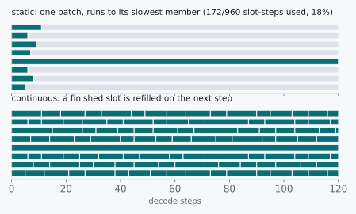

# The Slot That Waited

> Eight sequences in flight, and one of them doing all the work.


Chapter 8 left us a number we could act on. On an 80 GB card the KV
cache holds about 64 sequences, so we size the batch at 64, fill every
slot, and go look at the throughput counter with some optimism.

It reads like a batch of sixteen.

Now, everything checks out. Every slot is occupied. Memory is full. The
scheduler reports 64 live sequences and nothing is queued. And we are
getting a quarter of the tokens per second that chapter 7's arithmetic
promised for a batch that size.

Nothing in the last two chapters explains a factor of four. So let's go
find it.

## 9.1 Candidates and the Ratio

Two explanations fit what we are seeing, and it is worth separating them
carefully, because one of them is a bug and the other is a decision we
made on purpose without noticing.

The first: chapter 8's budget was optimistic. Activations,
workspace and fragmentation ate more than the couple of gigabytes we
waved at, so we are not really running 64 sequences. We are running
sixteen and misreporting it.

The second: all 64 slots really are occupied, and most of them are
occupied by sequences that finished a while ago.

It is worth separating those carefully, because they have opposite
fixes. The first is a memory-accounting bug, and you solve it by
measuring more carefully. The second is not a bug at all. It is a
consequence of how we decided to schedule, and no amount of careful
measurement will shift it by a single token.

## 9.2 The Axioms

Here is the thing chapters 7 and 8 never priced: sequences do not
finish together.

Two of them, sitting side by side in the same batch, can differ in
output length by two orders of magnitude, and neither one is unusual.

| Quantity | Value |
|---|---|
| "What is 2+2?" | ~5 output tokens |
| "Explain the CAP theorem" | ~400 output tokens |
| Ratio between them | **~80×** |
| A batch, once launched, runs until | its **slowest** member finishes |

That last row is doing all the damage, and I want to point at it
directly, because it is a choice dressed up as a law.

We launch a batch. We run it to completion. We launch the next one.
That is the obvious way to write the loop. It is how you would write it
on a whiteboard, it is how every framework wrote it the first time, and
there is nothing wrong with it except what it costs.

## 9.3 Doing the Division

Take eight requests with a spread any real service would call a quiet
afternoon, and count the slot-steps we bought against the slot-steps we
used. A slot-step is one sequence occupying one batch slot for one
forward pass. It is the atomic unit of the thing we are actually
paying for.

```
output lengths        =  5, 8, 6, 120, 7, 9, 6, 11
batch runs for        =  max(lengths)          =  120 steps
slot-steps purchased  =  8 slots × 120 steps   =  960
slot-steps used       =  5+8+6+120+7+9+6+11    =  172

occupancy  =  172 / 960  =  18%
```

Eighteen percent.

We provisioned a batch of eight and got the throughput of roughly one
and a half. Scale the same distribution up to 64 slots and the
shortfall is the factor of four we measured, with room to spare.

If you carry one number out of this chapter, carry occupancy rather
than batch size. Batch size is what you configured. Occupancy is what
you bought, and nobody puts it on a dashboard.



Look at the top half of that picture for a moment. Seven of the eight
lanes go dark inside the first eleven steps and then just sit there,
dark, for another hundred and nine, while one long sequence grinds to
the end.

The slots did not fail. They finished. And then they waited, because we
never built them a way to leave.

<div class="rule" id="iteration-scheduling">
<span class="rule-id">Rule 11 · Release the slot when the sequence ends, not when the batch does</span>
Schedule at the granularity of one forward pass, not one request. A
finished sequence should leave the batch on the step it finishes, and a
waiting one should take its place immediately.
</div>

## 9.4 What This Rules Out

This rules out the memory-accounting candidate, and it rules it out
cleanly, because the arithmetic above never mentions bytes. Not once.

You can hand the scheduler a perfectly measured 64-sequence budget and
still get 18% occupancy, because the waste is in *time*, not space.
Every fix aimed at memory (a tighter budget, less fragmentation, a
bigger card) leaves that number exactly where it is.

It also rules out the reflex to blame padding, which is where most
people go first, myself included.

Padding is real. Shorter prompts get padded up to the longest one in
the batch, and those padded positions cost attention work. But padding
is bounded by the spread in *prompt* lengths within a single step,
which is a small constant. What we just measured is bounded by the
spread in *output* lengths across the batch's whole lifetime, which is
80×. Those are not the same problem and they are nowhere near the same
size, and if you spend a week on the first one you will move the second
one by nothing.

What survives is the second, and the fix falls straight out of it.
If the loss comes from a finished sequence holding a slot, then let it
go. After every forward pass, ask which sequences emitted an
end-of-sequence token, evict them, and admit whatever is queued into
the space they left behind.

The batch stops being a fixed group of requests that start and end
together, and becomes a running set that sequences join and leave
continuously.

<div class="aside">
This is <a href="./05-group-commit.md#adaptive-batching">group
commit</a> for the third time, and the resemblance is close enough to be
worth naming out loud. There, we stopped closing a batch on a fixed
count and started closing it when the in-flight fsync returned. Here, we
stop closing a batch on a fixed set of requests and start reconsidering
it every forward pass. Both replace a schedule fixed in advance with one
that reacts to what actually finished. Chapter 7 borrowed group commit's
amortization. This chapter borrows its <em>timing</em>.
</div>

The idea comes from Orca (OSDI '22), where it is called iteration-level
scheduling, and it is the largest single throughput win in modern
inference serving. Not because it makes any kernel faster. Not one
kernel changed. Because it stops us renting slots to sequences that
finished their work and had nowhere to go.

## 9.5 The Pictorial

The mechanism fits in a loop short enough to read in one breath:

```
every forward pass:
    admit    while len(running) < max_seqs and queue is not empty:
                 prefill the next request, splice it into the batch
    harvest  record each running sequence's newest token
    evict    drop the ones that hit EOS or their token budget
    forward  one single-token pass over whatever survived
```

Four steps. And the order of the middle two is the entire chapter.
Evict before the forward pass and a finished sequence costs you
nothing. Evict after it, or at the end of the batch like we used to,
and you are back at eighteen percent.

<div class="aside">
<strong>Build it.</strong> This is where the book hands off to
<a href="https://github.com/Venugopalan2610/vllm-from-scratch">vllm-from-scratch</a>,
a twenty-stage course that constructs the engine these last chapters
derive. Stage 04 makes you build the static batch and measure its own
padding waste; stage 05 makes you build this loop and will not let you
past until it uses under 60% of the forward passes the static version
needed. See <a href="./experiments.md">Experiments</a>.
</div>

<div class="challenges">

## Challenges

1. The loop above evicts finished sequences before the forward pass. Work
   out what happens to a request's output if you evict after it instead,
   and say precisely which token goes missing.

2. Admitting a new request means prefilling its prompt and splicing that
   prompt's KV into a batch whose sequences are all at different
   lengths. Sketch the tensor operations that requires, and estimate how
   much copying happens per admission. Then say what the copy cost is
   proportional to, and why that makes admission expensive at exactly
   the moment you want it to be cheap.

3. With the loop above and a 64-slot budget, what workload would still
   produce low occupancy? Describe the output-length distribution that
   defeats iteration-level scheduling, and say whether you think it
   occurs in practice.

4. A request arrives while the batch is full. Iteration-level scheduling
   says it waits for a slot. Chapter 8 says slots are bounded by KV
   memory, not by a count. Design the admission rule that decides
   whether a newly arrived request can start, given that you do not know
   how long it will run. (Nothing above answers this; the next chapter
   changes the memory model underneath it, which changes the answer.)

</div>

<div class="challenges" id="design-note">

## Design Note: The Cheapest Optimizations Are Refusals

Nothing in this chapter made anything faster.

I want to be precise about that, because it is easy to skim past. No
kernel changed. No byte moved sooner. No arithmetic got cheaper. We
found a place where the system was doing work it did not have to do,
and we stopped doing it.

That is worth noticing, because it is the pattern behind most of the
large wins in this book. Group commit did not make fsync faster, it
stopped calling it once per writer. Write-ahead logging did not make
the disk quicker, it stopped waiting on data pages before
acknowledging. Here we did not make decoding faster, we stopped renting
slots to sequences that had already gone home.

The engineering instinct, faced with a throughput number that is four
times too low, is to go looking for something to speed up. That
instinct is strong and it feels productive and it is usually the second
best thing to do.

Spend an hour first on the less flattering question: what is this
system doing that it does not need to do at all? The answer tends to be
cheaper to implement and larger in effect than whatever you were about
to optimize, and it has the rare and pleasant property that the code
gets shorter.

</div>
