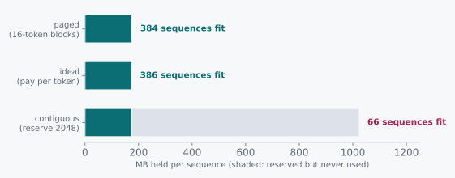

# A Page Table for Tokens

> The KV cache we paid for, and the KV cache we used.

Chapter 8 priced the KV cache at 512 KB per token, 1 GB per 2048-token
sequence, and concluded that 66 GB of free memory holds about 66
sequences. Chapter 9 taught those 66 slots to release themselves the
moment they finish.

Now go and measure the traffic. On a real service, the mean request
produces about 350 tokens. Not 2048. Three hundred and fifty.

That is a sixth of the length chapter 8 budgeted for, so the same 66 GB
ought to hold something in the neighbourhood of four hundred sequences.

It holds 66.

It held 66 back when requests averaged 2048 tokens, and it holds 66 now
that they average 350. The budget did not notice that the work got
smaller, and I find that a genuinely strange thing for a budget to do.

## 10.1 Candidates and the Ratio

Either the number is right and our expectation was wrong, or the number
is wrong and something is being wasted. Both are respectable positions
until we do the arithmetic.

The first: 512 KB per token is simply what it costs, the requests
are longer than we think, and 66 is the honest answer.

The second: we are paying for tokens that do not exist.

The ratio between those is the ratio between 2048 and 350, which is
about six. That is well past the point where it is worth an hour to
find out which one is true, and the two answers point at completely
different purchases. One says buy memory. The other says stop wasting
the memory you already have.

## 10.2 The Axioms

The reason the budget cannot notice that requests got shorter is that
it is committed before the first token is ever generated.

| Quantity | Value |
|---|---|
| KV cache per token, 7B fp16 | 512 KB |
| Maximum context we must support | 2048 tokens |
| Reserved per sequence at admission | 2048 × 512 KB = **1 GB** |
| Mean tokens actually generated | ~350 |
| Actually used per sequence | 350 × 512 KB = **175 MB** |

That middle row is the axiom, and like chapter 9's it is a choice
wearing the costume of a law. Let me take it apart, because three
separate facts conspire here and none of them looks like a problem on
its own.

A sequence's KV cache has to be contiguous, because attention strides
through it as a single tensor. It has to be allocated before generation
starts, because we cannot move it afterwards without invalidating every
pointer into it. And its final size is unknowable at admission, because
the model decides when to stop and it has not decided yet.

Three reasonable facts. Put them together and the allocator's hand is
forced: reserve the worst case, or risk running out mid-sequence with
nowhere to grow.

## 10.3 Doing the Division

So put the reservation next to the reality. One line for what every
sequence is charged at admission, one for what it turns out to need, and
the gap between them is the whole problem:

```
reserved per sequence  =  2048 tokens × 512 KB  =  1024 MB
used per sequence      =   350 tokens × 512 KB  =   175 MB

waste  =  1 − 350/2048  =  83%
```

Eighty-three percent of the most expensive memory in the building, held
against tokens that were never generated and never will be.

The vLLM paper measured this across real serving traces and put the
figure between 60% and 80%, so our 83% is the high end of an entirely
ordinary range rather than some pathological case I constructed to make
a point.



And now, if you squint at the problem rather than at the vocabulary, the
answer becomes visible. Because this is not a new problem.

A resource that must appear contiguous to whoever is using it, whose
final size is unknown when you allocate it, handed out to many
processes at once. That is the problem operating systems solved in
1961. And the answer then was to stop making physical contiguity a
requirement at all.

So: chop the KV cache into fixed-size blocks, sixteen tokens each. Give
every sequence a small array mapping its logical block index to
whichever physical block it happened to get. Allocate a block when the
sequence grows into it, and not one step sooner.

```
blocks needed for 350 tokens  =  ceil(350 / 16)  =  22 blocks
allocated                     =  22 × 16 tokens  =  352 tokens
waste                         =  2 tokens
```

Two tokens. Against 1698 under reservation.

The waste is now bounded by the block size instead of by the context
limit, which is to say it is bounded by a number we chose rather than a
number the model chose. That is the whole difference, and it is worth
more than it sounds.

<div class="rule" id="blocks-not-reservations">
<span class="rule-id">Rule 12 · Page the cache; reserve for the token you have</span>
When a per-client allocation grows unpredictably toward a large
ceiling, allocate it in fixed-size blocks with an indirection table.
Waste falls from the gap between actual and maximum to under one block.
</div>

## 10.4 What This Rules Out

This rules out buying memory, on economics rather than principle.

A card with twice the memory takes our 66 sequences to 132, at GPU
prices, while leaving 83% of both cards idle. Fixing the allocator gets
us to 384 on the card we already own. When a resource is 83% wasted,
the return on buying more of it is seventeen cents on the dollar, and
that ratio holds no matter how much of it you buy. You cannot purchase
your way out of a waste fraction.

It also rules out a subtler instinct, which is to shrink the context
limit. Dropping the maximum from 2048 to 512 genuinely would cut the
reservation by four. It would also break every request that needed more
than 512 tokens, which is a product decision smuggled into a memory
optimization, and those are the worst kind of decision because nobody
is in the room to object. Paging gets the same memory back without ever
telling a user their conversation is too long.

What survives is the indirection, and it pays a second dividend that
has nothing to do with waste.

Once a sequence's cache is a list of block pointers instead of a
contiguous range, two sequences can point at the same block. A prompt
that many requests share, the system prompt every conversation starts
with, gets computed once and pointed at by all of them. Refcount the
blocks, copy on write when a sequence diverges, and prefix sharing
falls out of the very same table we built to fix fragmentation.

That is the sign of a good structure, incidentally. You build it for
one reason and it hands you a second thing you were not asking for.

<div class="aside">
The cost is that attention can no longer stride a contiguous tensor:
the kernel has to gather K and V through the block table, one block at
a time. That is why PagedAttention needed a custom kernel rather than a
call into an existing attention library, and it is the admission price
for everything above. Writing that kernel is stage 08 of the course,
and it is the hardest stage in it.
</div>

## 10.5 The Pictorial

Two sequences, sixteen tokens to a block, sharing a system prompt they
both begin with:

```
  seq A logical:  [ 0 ][ 1 ][ 2 ][ 3 ]
  block table A:    7    3    9   12
                    |    |    \    \
  physical pool:  [ 7 ][ 3 ][ 9 ][12 ][ 4 ][ 1 ] ...
                    |    |    /
  block table B:    7    3    4
  seq B logical:  [ 0 ][ 1 ][ 2 ]

  blocks 7 and 3 are the shared prompt: one copy, refcount 2
  logical order is contiguous; physical order is whatever was free
```

The left half of each sequence is literally the same memory. Neither
sequence can tell, and neither one ever sees a physical address.

<div class="aside">
<strong>Build it.</strong>
<a href="https://github.com/Venugopalan2610/vllm-from-scratch">vllm-from-scratch</a>
stages 06 through 09 construct exactly this: the block allocator and
free list, then attention that reads through the block table in
PyTorch, then the same kernel in Triton, then refcounting,
copy-on-write and a content-hashed prefix cache. Stage 06 will not pass
until your paged allocator fits more than three times the sequences a
contiguous one does, on your own card, with your own model's numbers.
</div>

<div class="challenges">

## Challenges

1. Block size 16 is the standard default. Compute the average internal
   fragmentation per sequence at block sizes 1, 16 and 256, then say
   what goes wrong at each end. One of the two failure modes is not
   about memory at all.

2. Chapter 9's challenge 4 asked how to decide whether a newly arrived
   request can be admitted. Paging changes the answer: a sequence now
   needs one block to start rather than 1 GB. Write the admission rule,
   and then find the failure it introduces, which is that a sequence
   admitted cheaply can run out of blocks halfway through generating.

3. Two sequences share a block by refcount. One of them generates a
   token that lands in that shared block. Describe exactly what must
   happen, in what order, and what goes wrong if the refcount is
   decremented after the copy instead of before.

4. Prefix sharing needs to recognise that two requests begin with the
   same tokens. Hashing each block's contents is the obvious approach.
   Work out why hashing a block's own tokens alone is not enough, and
   what else has to go into the hash. (The failure this prevents is a
   correctness bug and a privacy bug at the same time.)

</div>

<div class="challenges" id="design-note">

## Design Note: The Answer Was Sixty Years Old

PagedAttention is a 2023 paper about a 2023 problem, and its central
idea is virtual memory, which shipped in the Atlas computer in 1962.

The mapping is not an analogy the paper reaches for in the discussion
section to sound erudite. It is the design. Blocks are pages. Block
tables are page tables. Sharing is `fork`. Divergence is
copy-on-write. Running out is a page fault, handled by eviction.

There is something in that worth more than the specific trick.

The KV cache problem arrived looking like a machine learning problem,
and it was wearing all the machine learning clothes: attention, tokens,
transformers, hardware nobody had five years earlier. Solve it as a
machine learning problem and you get machine learning answers, and the
field did try those first. Smaller caches. Shorter contexts. Cleverer
padding. All reasonable. All small.

But describe it in its own terms and it is a memory allocator with
unpredictable per-client growth against a hard ceiling. That
description has sixty years of prior work bolted to it, and the prior
work is better than anything you or I would derive from scratch in a
quarter, because a great many careful people already spent their
careers on it.

The skill being exercised there is not knowing about paging. Most
working engineers know about paging. It is noticing, while surrounded
by transformer vocabulary, that the thing in front of you has a shape
you have seen somewhere before.

</div>
