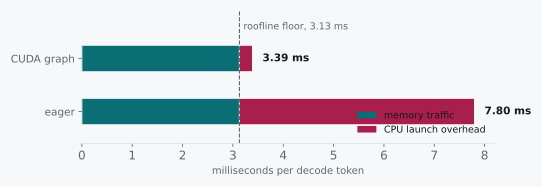

# Below the Floor

> Two hundred and eighty launches, and the bus waiting through all of them.


Chapter 7 told us decoding is memory-bound, and that claim came with a
promise attached, whether or not it was stated out loud. If the
bottleneck is the memory bus, then the time to make a token should be
the time it takes to drag the weights across that bus. Nothing more.
Nothing else is on the critical path.

Promises like that are checkable, and I think you should check them,
especially the ones you like. So let's check it on a small model where
every number is easy to hold in your head. A 0.6B model in bf16, 1.19
GB of weights, on a card whose streaming bandwidth measures 380 GB/s.

```
roofline floor  =  1.19 GB ÷ 380 GB/s  =  3.13 ms/token
measured        =                         7.80 ms/token
```

Two and a half times the floor.

The card is achieving 153 GB/s out of the 380 it demonstrably has,
which is forty percent of a bus chapter 7 said should be saturated.
Somewhere inside every single token, four and a half milliseconds are
going somewhere that is not the memory bus, on a workload we have spent
two chapters calling memory-bound.

## 11.1 Candidates and the Ratio

There are two ways to explain a measurement that misses its floor, and
they point in opposite directions: either the floor is wrong, or our
account of where the time goes is incomplete.

The first: the 380 GB/s figure is a streaming-copy number, and the
weight reads in a real forward pass have an access pattern that cannot
reach it. Real achievable bandwidth here is nearer 153 GB/s, and the
floor was wrong from the start.

The second: the bus really does deliver 380 GB/s, and the extra 4.67
ms is time when nothing is being read at all.

Chapter 1 handed us the tool for exactly this shape of question, and it
is worth going back for it. The [floor test](./01-twenty-five-microseconds.md#floor-test)
says a measurement that beats a theoretical floor means the work did not
happen.

This is that same rule, looked at from the other end. A measurement that
*misses* a floor by 2.5× means work happened that we were not counting.
Either the floor is wrong, or our picture of what the machine is doing
has somebody missing from it. Those are our two candidates, and the
arithmetic can tell them apart without us guessing.

## 11.2 The Axioms

To tell those apart we need to know what the machine is made of, and in
particular we need one number that neither of the previous two chapters
ever asked for. The first four rows below are about the model and the
card. The fifth is about something else entirely:

| Quantity | Value |
|---|---|
| Model weights, 0.6B bf16 | 1.19 GB |
| Measured streaming bandwidth | 380 GB/s |
| Transformer layers | 28 |
| GPU operations per layer (attention, MLP, norms) | ~10 |
| CPU cost to dispatch one operation, eager PyTorch | 5–20 µs |

That last row is the one chapters 7 and 8 never mentioned, and notice
that it is not a GPU number at all.

Every kernel that runs on that card was put there by the host. A Python
call, a dispatch through the framework, a driver call that enqueues work
on a stream. The GPU does not read its own program and decide what to do
next. Something on the CPU has to hand it each piece, one at a time, all
day long.

## 11.3 Doing the Division

So let's count the handoffs in one token.

```
operations per token  =  28 layers × ~10 ops  =  ~280 launches

unaccounted time      =  7.80 ms − 3.13 ms    =  4.67 ms
per launch            =  4.67 ms ÷ 280        =  ~17 µs
```

<p class="quip">Two hundred and eighty times per token, a CPU says go, and a GPU that could have started already waits to be told.</p>

Seventeen microseconds per operation, which sits comfortably inside the
5 to 20 µs the axiom table gives for eager dispatch.

The gap is not some mystery quantity we have to attribute on faith. It
is 280 individual acts of a CPU telling a GPU what to do next, each one
costing about what a Python-dispatched kernel launch costs, and together
they account for the missing time almost exactly.



So the first candidate goes. The bus is not slow. The bus is *idle*, waiting
for a CPU that is 280 function calls behind. Each kernel, once launched,
runs at full bandwidth. The problem was never inside any of them. The
problem is the gaps between them.

<div class="rule" id="floor-gap-is-cpu">
<span class="rule-id">Rule 13 · A workload that misses its own roofline floor is not yet bound by what you think</span>
When a memory-bound workload takes materially longer than
bytes ÷ bandwidth, the extra time is on the host, not the bus. Count
launches before optimizing kernels.
</div>

## 11.4 What This Rules Out

This rules out an entire category of fix, and it is the category
everybody reaches for first.

Every kernel in that forward pass could be made twice as fast and the
token would still carry 4.67 ms of CPU time, because the CPU work
happens *between* the kernels, not inside them. Optimizing a kernel
that is already bandwidth-saturated, in a step where sixty percent of
the wall clock is dispatch, is a week spent on the other forty.

It also rules out more bandwidth. A card at 760 GB/s halves the 3.13 ms
and leaves the 4.67 alone, taking 7.80 down to 6.23. You would have
doubled the most expensive component in the machine for a twenty percent
improvement, and the profiler would still show a bus at forty percent
utilization, except now it would be at twenty.

What survives is an observation about repetition. That sequence of 280
launches is the same every single token. Same kernels. Same order. Same
shapes. Same buffers. We are paying a CPU to make an identical set of
decisions several hundred times a second, and it makes them correctly
every time, and none of them were ever in doubt.

That is a recording problem.

CUDA graphs let us capture the whole launch sequence once and replay it
as a single submission. The host makes one call instead of 280, and the
GPU walks the recorded graph itself. The arithmetic does not change at
all. The 3.13 ms of memory traffic is still there, still irreducible,
still the floor. What goes away is the waiting.

<div class="aside">
The catch is that a graph records exact pointers and exact shapes, which
is why serving systems capture one graph per batch size (1, 2, 4, 8, 16)
and pad up to the nearest. It also means prefill is never graphed: its
shapes change with every prompt. So the technique happens to apply
precisely to the phase that needed it, which is a convenient accident
rather than anybody's design.
</div>

## 11.5 The Pictorial

One token, drawn as a timeline of who is doing the work:

```
  eager, 7.80 ms
  CPU   ##  ##  ##  ##  ##  ##  ##  ##  ##  ##  ...  280 dispatches
  GPU     ##  ##  ##  ##  ##  ##  ##  ##  ##  ##
        ^^  ^^  ^^  ^^   bus idle in every gap

  graphed, ~3.4 ms
  CPU   #                                          one replay call
  GPU    ##############################            same kernels, no gaps
```

The GPU work is identical in both pictures. The only thing we deleted
was waiting for permission.

And notice what we did not have to understand to get here. We never
opened a kernel. We never looked at an access pattern. We never learned
what the attention implementation does with its tiles, and I could not
tell you offhand. We computed a floor, found a gap, divided the gap by a
count, and the answer named itself.

<div class="aside">
<strong>Build it.</strong> Stage 03 of
<a href="https://github.com/Venugopalan2610/vllm-from-scratch">vllm-from-scratch</a>
makes you measure this gap on your own card before you know what causes
it, and prints your floor next to your measurement. Stage 12 makes you
capture the graphs, and will not pass until replay is measurably faster
than eager and bit-identical to it. The 7.80 against 3.13 in this
chapter came from that stage, on a laptop 4080.
</div>

<div class="challenges">

## Challenges

1. The gap arithmetic assumed ~10 GPU operations per transformer layer.
   Look up or count the actual operations in one layer of a model you
   have handy, redo the per-launch division, and say whether 17 µs still
   looks like dispatch or whether something else is hiding in there.

2. CUDA graphs need static shapes, so a server captures one graph per
   batch size and pads up. Work out the cost of that padding at batch 5
   on a system with graphs at 1, 2, 4, 8, and say when the padding waste
   would exceed the launch overhead it saves.

3. This chapter's model was 0.6B. Redo the floor and the gap for a 7B
   model on the same card, and say whether launch overhead is a larger
   or smaller fraction of the token. Then say what that implies about
   which deployments care most about this fix.

4. Graph replay reuses the same input and output buffers every time.
   Describe the bug that produces, in a server handling concurrent
   requests, if the output buffer is handed to the caller directly. Then
   describe how you would detect it in production, given that it
   produces plausible text rather than a crash.

</div>

<div class="challenges" id="design-note">

## Design Note: The Floor Test Runs in Both Directions

Chapter 1 introduced the floor test as a fraud detector. Compute the
fastest the work could possibly go. Measure faster than that. Now you
know something you believed was happening did not happen, and a 4 KB
write that returns in 200 nanoseconds never reached the disk.

This chapter is the same instrument held upside down, and I have come to
think it is the more useful orientation.

Compute the floor, measure well *above* it, and you have found work you
were not modelling. Not a slow component. An *unmodelled* one. That
distinction matters enormously, because it redirects the entire search.
A slow component means go profile it and optimize it. An unmodelled
component means your picture of the machine is missing a participant,
and no amount of profiling the parts you already know about will
introduce you to somebody you did not know was in the room.

Both directions share one requirement, and it is the same requirement as
chapter 1's design note. You have to compute the floor *before* you
measure. A floor derived afterwards has an unfortunate habit of landing
suspiciously close to whatever you happened to observe, and you will
never catch yourself doing it. Write down bytes ÷ bandwidth first. Then
run the thing. Then let the gap be as embarrassing as it wants to be.

</div>
