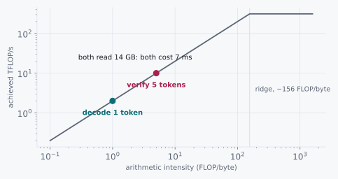

# Spending the Idle

> Five tokens for the price of one, and no asterisk.

Chapter 7 opened with a complaint: generating one token from a 7B model
on an A100 spends 45 microseconds computing and 7 milliseconds waiting,
and the most expensive processor in the building sits 99.4% idle. Five
chapters later we have moved a great deal of memory around and never
once addressed that.

So here is a measurement that ought to be impossible. Take five
candidate tokens, produced by something cheap, and ask the 7B model to
check all five in a single forward pass. Five times the arithmetic of a
normal decode step.

It takes the same 7 milliseconds.

## 12.1 Candidates and the Ratio

Candidate one: the check is not a real check. We are approximating,
sampling from something other than the model's true distribution, and
the five tokens we get out are not the five tokens the model would have
produced. Faster and slightly wrong is an old trade and usually a bad
one.

Candidate two: the arithmetic was free, because we had already paid for
it and were not using it.

The ratio worth naming here is 156 to 1, and we computed it in chapter
7. If the second candidate is right, this is not a clever trick so much
as the natural consequence of standing two orders of magnitude to the
left of the ridge, and the surprising thing is that it took the field
until 2023 to spend the change.

## 12.2 The Axioms

Everything needed is already on the table from chapter 7, which is a
good sign for a final chapter.

| Quantity | Value |
|---|---|
| Weight bytes read per forward pass | 14 GB, **independent of token count** |
| FLOPs per token of work | ~14 GFLOP |
| A100 ridge point | ~156 FLOP/byte |
| Memory time for one pass | ~7 ms |
| Compute time per token of work | ~45 µs |

The first row carries the chapter. A forward pass over K tokens reads
the weights exactly once, the same way a forward pass over one token
does, because the weights do not know how many tokens are passing
through them. That is the identical fact chapter 7 used to justify
batching, applied along a different axis: batching puts K *different
sequences* through one weight read, and this puts K *consecutive tokens
of one sequence* through it.

## 12.3 Doing the Division

```
generate 1 token   :  14 GB read,  14 GFLOP  →   1 FLOP/byte
verify 5 tokens    :  14 GB read,  70 GFLOP  →   5 FLOP/byte

ridge point        :                            156 FLOP/byte
```

Both sit far to the left of the ridge, so both are memory-bound, so both
cost what the memory costs:

```
memory time, either case  :  14 GB ÷ 2 TB/s   =  7.0 ms
compute time, generate 1  :  14 GFLOP ÷ 312 TFLOP/s  =   45 µs
compute time, verify 5    :  70 GFLOP ÷ 312 TFLOP/s  =  225 µs
```

The compute grew by 180 microseconds against a 7 millisecond wait. We
went from 99.4% idle to 96.8% idle and the wall clock did not move,
because at 5 FLOP/byte we are still 31× short of the ridge. Chapter 7
told us extra compute below the ridge buys nothing. Read the other way
round, it costs nothing, and that is the whole chapter.



<div class="rule" id="spend-below-ridge">
<span class="rule-id">Rule 14 · Below the ridge, spend compute on work that might be wasted</span>
Idle compute does not accrue. If arithmetic intensity is far under the
ridge point, speculative work is free even when most of it is thrown
away.
</div>

## 12.4 What This Rules Out

That leaves candidate one, which is the interesting one to set aside,
because the mechanism that rules it out is genuinely surprising.

The naive way to use those five tokens is to accept the ones that match
what the model would have picked and stop at the first that does not.
Under greedy decoding that is already exactly right. Under sampling it
is subtly wrong, because "matches the most likely token" is not the same
as "drawn from the model's distribution," and a system that quietly
sharpens its own sampling is precisely the quality-for-speed trade we
were trying to avoid.

Modified rejection sampling repairs it. Let q be the cheap proposer's
distribution and p the real model's. For each proposed token t, accept
it with probability min(1, p(t) ÷ q(t)). On rejection, draw the
replacement not from p but from the normalized residual max(0, p − q),
and stop there.

The residual is the part that makes it exact. Accepting at min(1, p/q)
alone under-samples tokens the proposer thought unlikely; sampling
rejections from p − q puts back exactly the mass that step removed. The
tokens that come out are distributed according to p. Not close to p, not
p with a tolerance: p.

<div class="aside">
This is the single cheapest thing to get subtly wrong in the whole
technique, because every unit test still passes. Renormalize p instead
of subtracting q and you get fluent, plausible, slightly-off text, and
the only instrument that detects it is a statistical test over tens of
thousands of samples. The course makes you build that test rather than
describing it, which is the only way I know to be sure.
</div>

So a bad proposer costs speed and never quality, which is a rare shape
for a trade-off and worth stating plainly: the failure mode of
speculative decoding is that it stops helping.

That also rules out reaching for a large K. If each token is accepted
with probability a, the expected yield of one target pass is one
guaranteed token plus the accepted run:

```
expected tokens per pass  =  1 + a + a² + ... + a^K

at a = 0.7:   K=4 → 2.77      K=8 → 3.19      K=16 → 3.32
```

Doubling K from 4 to 8 buys 0.42 tokens, because reaching the eighth
proposal requires eight consecutive acceptances. Past K of about 4 to 8
we are paying draft cost for tokens we will discard, and eventually
paying enough of it to matter even down here below the ridge.

## 12.5 The Pictorial

Where the proposals come from is almost an afterthought, which is the
best evidence that the idea is really about the ridge and not about
having a second model.

```
  n-gram proposer, no model at all:

    context:  ... def fibonacci(n):  if n < 2:  return n   def fib
    search backwards for "def fib" ---^                    ^-- match
    propose what followed last time:  onacci(n):  if n < 2:

  target model verifies all five in one 7 ms pass
  accepts the longest correct prefix, corrects the first miss
```

For code, structured output, or anything that quotes its own prompt,
that costs nothing and hits often. A small draft model does better on
prose and costs a fraction of a pass. Either way the expensive model
runs once and returns several tokens, and the idle compute from chapter
7 is what pays for it.

<div class="aside">
<strong>Build it.</strong> Stage 17 of
<a href="https://github.com/Venugopalan2610/vllm-from-scratch">vllm-from-scratch</a>
builds the n-gram proposer and the rejection sampler, and gates on the
statistical test: 120,000 draws with a deliberately terrible proposer,
and the emitted distribution has to match the target's to within 0.006.
It is the only stage in the course whose check is a hypothesis test, and
it is the one that convinced me the losslessness is real rather than
approximately real.
</div>

<div class="challenges">

## Challenges

1. Verification at K=5 sits at 5 FLOP/byte. Speculation and batching
   compose: a server running batch 32 with K=5 verification is at some
   intensity you can compute. Work it out, compare it to the ridge, and
   say whether the two techniques are still free when used together.

2. Derive the expected-tokens-per-pass formula in 12.4 from the
   acceptance probability a, rather than taking it on trust. Then find
   the K that maximizes tokens per pass once you charge the draft model
   at 5% of a target pass per proposed token.

3. Acceptance rate a is not a constant. Predict whether a is higher when
   the model is generating code or generating poetry, justify it in
   terms of the target's output distribution, and say what that implies
   about advertising a single speedup number for this feature.

4. Chapters 7 through 12 give four ways to move throughput: batch,
   page the cache, delete launch overhead, and speculate. A serving
   system has finite engineering time. Order them for a deployment
   whose requests average 30 output tokens and arrive 4 per second, and
   justify the order with arithmetic rather than preference. (Nothing
   above answers this; the arrival rate changes which wall you are
   against.)

</div>

<div class="challenges" id="design-note">

## Design Note: The Idle Was the Budget

Chapter 7 computed 99.4% idle and treated it as an indictment. It read
like waste, like something a better engineer would have prevented, and
the natural response was to go looking for the mistake that caused it.

Six chapters later the same number is a budget. The GPU is idle because
arithmetic intensity is far below the ridge, and that is not a defect to
be repaired but a resource sitting unspent. Speculative decoding is the
first technique in this book that treats it that way: it does five
tokens' worth of arithmetic to produce, on average, fewer than three
useful tokens, throws the rest away, and comes out ahead because the
arithmetic was never the scarce thing.

Which is the argument the whole book has been making, arriving at last
in a form specific enough to be uncomfortable. Every chapter here has
been about finding the one quantity that is actually scarce and
declining to optimize the others. In chapter 3 it was the fsync round
trip and not the bytes. In chapter 8 it was memory capacity and not
compute. Here it is bandwidth, and the correct response to a scarce
resource is to spend the abundant ones freely, including on work you
expect to discard.

The uncomfortable part is that this reverses what good engineering feels
like. Doing arithmetic you know will be thrown away, on purpose, at a
ratio of five to three, offends an instinct most of us have been
rewarded for having. The instinct is right whenever compute is scarce.
It is precisely wrong here, and telling those two situations apart is
what the ratio in chapter 7 is for.

That is where this book stops deriving and
[vllm-from-scratch](https://github.com/Venugopalan2610/vllm-from-scratch)
starts building. Twenty stages, each gated on a measurement rather than
on your code merely running: the naive loop, the KV cache, the roofline
you just read about, static and then continuous batching, the block
allocator, paged attention in PyTorch and then in Triton, prefix
caching, the scheduler, chunked prefill, CUDA graphs, the sampler, the
detokenizer, the server, and the rejection sampler from this chapter.
The chapters tell you which number matters and why. The stages will not
let you past until your version of it moves.

</div>
